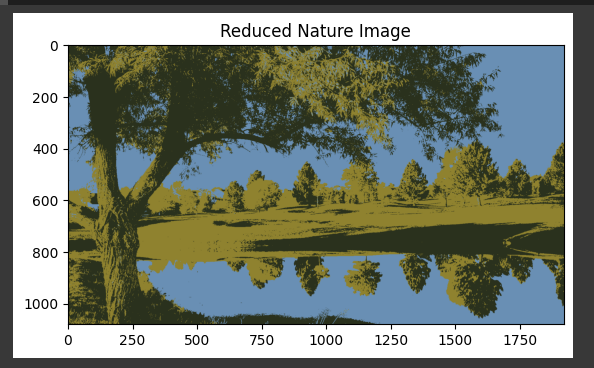

# Description

- This project implements the K-Means Algorithm(from scratch) for color quantization, reducing the number of colors in an image while preserving its overall appearance.
- By clustering similar colors together, K-Means effectively reduces the color palette, optimizing the image storage and processing without significant loss in visual quality.

# Visualization
- Original Image

- Reduced Image (K=2)

- Reduced Image (K=3)

- Reduced Image (K=5)

